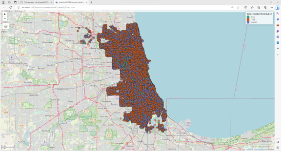

# Abstract

------------------------------------------------------------------------

# Data Exploration

```{r data_exploration}
library(stringr)
library(rmarkdown)
library(sf)
library(ggplot2)
library(dplyr)
library(stringi)
library(lubridate)
library(mapview)
library(leafpop)
library(spatstat)
library(dbscan)
library(RColorBrewer)
library(nngeo)
library(tibble)
library(factoextra)
library(png)
library(spatstat)
knitr::opts_chunk$set(echo=FALSE, include = FALSE, fig.width = 5, fig.height = 3,
                      fig.align = 'center')
data=read.csv('CrimesChicago20220225.csv')
data=data[,c('DATE..OF.OCCURRENCE','PRIMARY.DESCRIPTION','BEAT',
              'WARD','LATITUDE','LONGITUDE')]
data=na.omit(data)
data$DATE..OF.OCCURRENCE=as.POSIXlt(data$DATE..OF.OCCURRENCE,
                                    tz='America/Detroit',
                                    tryFormats ='%m/%d/%Y %I:%M:%S %p')
data=data%>%
  rename(DATE=DATE..OF.OCCURRENCE,DESCRIPTION=PRIMARY.DESCRIPTION)

data=data%>%
  rename_with(.fn = function(x){str_to_title(x)})%>%
  mutate(Day=wday(Date,label=TRUE)) %>%
  mutate(Month=month(Date,label=TRUE))%>%
  mutate(Hour=hour(Date))

#Hourly Crime Distribution
ggplot(data = data, aes(x=Hour))+
  stat_count(fill='lightblue',color='black')+
  labs(title = 'Hourly Crime Distribution')+
  ylab('Frequency')+
  scale_x_discrete(breaks=1:23, limits=as.character(1:23))+
  theme_gray()+
  theme(plot.title = element_text(hjust = 0.5, size = 12))

#daily crime distribution
knitr::opts_chunk$set(echo = TRUE)
ggplot(data = data, aes(x=Day))+
  stat_count(fill='lightblue',color='black')+
  labs(title='Daily Crime Distribution')+
  xlab('Day')+
  ylab('Frequency')+
  scale_x_discrete()+
  theme_gray()+
  theme(plot.title = element_text(hjust = 0.5, size = 12))

#monthly crime distribution
ggplot(data = data, aes(x=Month))+
  stat_count(fill='lightblue',color='black')+
  labs(title='Monthly Crime Distribution')+
  ylab('Frequency')+
  scale_x_discrete()+
  theme_gray()+
  theme(plot.title = element_text(hjust = 0.5, size = 12))

#monthly crime distribution
ggplot(data = data, aes(x=Description))+
  stat_count(fill='lightblue',color='black')+
  labs(title='Crime Distribution by Category')+
  ylab('Frequency')+
  theme_grey()+
  theme(axis.text.y = element_text(size = 7))+
  coord_flip()+
  theme(plot.title = element_text(hjust = 0.5, size = 12))

#group according to crime "category"

data_filtered=data%>%
  mutate(Category=case_when(str_detect(Description,'HOMICIDE')~'Homicide',
                        str_detect(Description,'ASSAULT')~'Assault',
                        str_detect(Description,'MOTOR VEHICLE THEFT')~'Vehicle Theft',
                        .default = 'Other' ))%>%
  filter(str_detect(Category,'Homicide|Assault|Vehicle Theft'))

#hourly crime distribution by category of crime
data_filtered%>%
  group_by(Category,Hour)%>%
  ggplot(aes(x=Hour,fill=Category))+
  labs(title='Hourly Crime Distribution')+
  ylab('Frequency')+
  stat_count(color='black')+
  scale_x_discrete(breaks=1:23, limits=as.character(1:23))+
  theme_grey()+
  theme(plot.title = element_text(hjust = 0.5, size = 12))


data_sf=st_as_sf(data_filtered,
                 coords = c('Longitude','Latitude'),
                 crs = 'EPSG:4326')
data_sf=data_sf%>%
  filter(!is.na(geometry))
shp=list.files(pattern = '.shp')
mapviewOptions(basemaps='OpenStreetMap', fgb = FALSE)
crime_map=mapview(data_sf,
                  zcol='Category',
                  col.regions=brewer.pal(3,'Dark2'),
                  legend=TRUE,
                  popup=popupTable(x=data_sf,
                                   row.numbers=FALSE,
                                   feature.id=FALSE),
                  layer.name='Crime Spatial Distribution')
projected=st_transform(data_sf, crs = 'EPSG:26916')


```

------------------------------------------------------------------------

# Spatial Clustering

```{r Homicide, echo=TRUE}
#project data to meter form


#extract relevant category
homicide=projected%>%
  filter(Category=='Homicide')%>%
  st_coordinates()%>%
  as.data.frame()
  colnames(homicide)=c('Longitude','Latitude')
  
#make a density plot for reference
ggplot(data=homicide,aes(x=Longitude, y=Latitude))+
  geom_density2d_filled(bins=5, color='white')+
  labs(title='Homicide Crime Density',
       caption = ('CRS:UTM16-N Projection'))+
  theme_grey()+
  theme(plot.title = element_text(hjust = 0.5, size = 12),
        legend.position = 'none')

#nearest distance to 100th neighbor for minPts=100
knn_10=sort(kNNdist(homicide,k=10))
plot(knn_10, main = '10th-Nearest Neighbor Distance (Ordered)',
     xlab = NA,
     ylab = 'eps Approximation',
     type = 'l',
     las=2)+
grid()
#use eps=1000 based on plot

#nearest distance to 1000th neighbor for minPts=1000
knn_100=sort(kNNdist(homicide,k=50))
plot(knn_100, main = '100th-Nearest Neighbor Distance (Ordered)',
     ylab = 'eps Approximation',
     type = 'l',
     las=2)+
grid()
#use eps=2750 based on plot

#high eps relative to low min pts
homicide%>%
dbscan(eps=1800, minPts = 10)%>%
fviz_cluster(data = homicide, geom = 'point',
               main = 'DBSCAN Clustering of Homicide Crimes', pointsize = 0.05)+
  theme(plot.title = element_text(hjust = 0.5, size = 12))

#low eps relative to high min pts
db_homicide=homicide%>%
dbscan(eps=2000, minPts = 50)
fviz_cluster(db_homicide,data = homicide, geom = 'point',
               main = 'DBSCAN Clustering of Homicide Crimes', pointsize = 0.05)+
  theme(plot.title = element_text(hjust = 0.5, size = 12))

#HDBSCAN clustering for centroid
hb_homicide=homicide%>%
  as.matrix()%>%
  dist()%>%
  hdbscan(minPts=10)
plot(hb_homicide)

#kmeans clustering
k_homicide=homicide%>%
  scale()%>%
  kmeans(centers = 5)
fviz_cluster(k_homicide,data=homicide, geom = 'point',
               main = 'Kmeans Clustering of Homicide Crimes', pointsize = 0.05)+
  theme(plot.title = element_text(hjust = 0.5, size = 12))

homicide_clust_geo=cbind(homicide,db_homicide$cluster,hb_homicide$cluster,k_homicide$cluster)
homicide_clust_geo=st_as_sf(homicide_clust_geo,
           coords = c('Longitude','Latitude'),
           crs='EPSG:26916')%>%
  st_transform(crs=4326)
```

```{r Assault, echo=TRUE}
#extract relevant category
assault=projected%>%
  filter(Category=='Assault')%>%
  st_coordinates()%>%
  as.data.frame()
  colnames(assault)=c('Longitude','Latitude')
  
#make a density plot for reference
ggplot(data=assault,aes(x=Longitude, y=Latitude))+
  geom_density2d_filled(bins=5, color='white')+
  labs(title='Assault Crime Density',
       caption = ('CRS:UTM16-N Projection'))+
  theme_grey()+
  theme(plot.title = element_text(hjust = 0.5, size = 12),
        legend.position = 'none')

#nearest distance to 100th neighbor for minPts=100
knn_50=sort(kNNdist(assault,k=50))
plot(knn_50, main = '50th-Nearest Neighbor Distance (Ordered)',
     xlab = NA,
     ylab = 'eps Approximation',
     type = 'l',
     las=2)+
grid()

#nearest distance to 1000th neighbor for minPts=1000
knn_500=sort(kNNdist(assault,k=500))
plot(knn_500, main = '500th-Nearest Neighbor Distance (Ordered)',
     xlab = NA,
     ylab = 'eps Approximation',
     type = 'l',
     las=2)+
grid()

#high eps relative to low min pts
assault%>%
dbscan(eps=1000, minPts = 50)%>%
fviz_cluster(data = assault, geom = 'point',
               main = 'DBSCAN Clustering of Assault Crimes', pointsize = 0.05)+
  theme(plot.title = element_text(hjust = 0.5, size = 12))

#low eps relative to high min pts
db_assault=assault%>%
dbscan(eps=1500, minPts = 500)
fviz_cluster(db_assault,data = assault, geom = 'point',
               main = 'DBSCAN Clustering of Assault Crimes', pointsize = 0.05)+
  theme(plot.title = element_text(hjust = 0.5, size = 12))

#HDBSCAN clustering for centroid
hb_assault=assault%>%
  as.matrix()%>%
  dist()%>%
  hdbscan(minPts=500)
plot(hb_assault)

#kmeans clustering
k_assault=assault%>%
  scale()%>%
  kmeans(centers = 5)
fviz_cluster(k_assault,data=assault, geom = 'point',
               main = 'Kmeans Clustering of Assault Crimes', pointsize = 0.05)+
  theme(plot.title = element_text(hjust = 0.5, size = 12))

assault_clust_geo=cbind(assault,db_assault$cluster,hb_assault$cluster,k_assault$cluster)
assault_clust_geo=st_as_sf(assault_clust_geo,
           coords = c('Longitude','Latitude'),
           crs='EPSG:26916')%>%
  st_transform(crs=4326)
```

```{r Vehicle, echo=TRUE}
#extract relevant category
vehicle=projected%>%
  filter(Category=='Vehicle Theft')%>%
  st_coordinates()%>%
  as.data.frame()
  colnames(vehicle)=c('Longitude','Latitude')
  
#make a density plot for reference
ggplot(data=vehicle,aes(x=Longitude, y=Latitude))+
  geom_density2d_filled(bins=5, color='white')+
  labs(title='Vehicle Theft Crime Density',
       caption = ('CRS:UTM16-N Projection'))+
  theme_grey()+
  theme(plot.title = element_text(hjust = 0.5, size = 12),
        legend.position = 'none')

#nearest distance to 100th neighbor for minPts=100
knn_50=sort(kNNdist(vehicle,k=50))
plot(knn_50, main = '50th-Nearest Neighbor Distance (Ordered)',
     xlab = NA,
     ylab = 'eps Approximation',
     type = 'l',
     las=2)+
grid()

#nearest distance to 1000th neighbor for minPts=1000
knn_500=sort(kNNdist(vehicle,k=500))
plot(knn_500, main = '500th-Nearest Neighbor Distance (Ordered)',
     xlab = NA,
     ylab = 'eps Approximation',
     type = 'l',
     las=2)+
grid()

#high eps relative to low min pts
vehicle%>%
dbscan(eps=1000, minPts = 50)%>%
fviz_cluster(data = vehicle, geom = 'point',
               main = 'DBSCAN Clustering of Vehicle Theft Crimes', pointsize = 0.05)+
  theme(plot.title = element_text(hjust = 0.5, size = 12))

#low eps relative to high min pts
db_vehicle=vehicle%>%
dbscan(eps=1750, minPts = 400)
fviz_cluster(db_vehicle,data = vehicle, geom = 'point',
               main = 'DBSCAN Clustering of Vehicle Theft Crimes', pointsize = 0.05)+
  theme(plot.title = element_text(hjust = 0.5, size = 12))

#HDBSCAN clustering for centroid
hb_vehicle=vehicle%>%
  as.matrix()%>%
  dist()%>%
  hdbscan(minPts=500)
plot(hb_vehicle)

#kmeans clustering
k_vehicle=vehicle%>%
  scale()%>%
  kmeans(centers = 5)
fviz_cluster(k_vehicle,data=vehicle, geom = 'point',
               main = 'Kmeans Clustering of Vehicle Theft Crimes', pointsize = 0.05)+
  theme(plot.title = element_text(hjust = 0.5, size = 12))

vehicle_clust_geo=cbind(vehicle,db_vehicle$cluster,hb_vehicle$cluster,k_vehicle$cluster)
vehicle_clust_geo=st_as_sf(vehicle_clust_geo,
           coords = c('Longitude','Latitude'),
           crs='EPSG:26916')%>%
  st_transform(crs=4326)
```

large eps less outliers
small eps more outliers
small eps and large minPts will yield extremely high peak points and a lot of noise points, meaning that you may miss patterns on a more local level.


------------------------------------------------------------------------

# Spatial Structure

```{r, echo=TRUE}
homicide_cent=homicide%>%
  add_column(cluster)
  group_by(db_homicide$cluster)%>%
  summarise(lat=mean(Latitude),long=mean(Longitude))%>%


assault_cent=assault%>%
  group_by(db_assault$cluster)%>%
  summarise(lat=mean(Latitude),long=mean(Longitude))

vehicle_cent=vehicle%>%
  group_by(db_vehicle$cluster)%>%
  summarise(lat=mean(Latitude),long=mean(Longitude))
```


```{r, echo=TRUE}
homicide_cent%>%
  st_as_sf(coords = c('lat','long'),
         crs = 'EPSG:26916')%>%
  st_transform(crs=4326)%>%
  st_nn(.,.,k=2,returnDist = TRUE)%>%
  unlist()
```


```{r, echo=TRUE}
st_as_sf(assault_cent,
         coords = c('lat','long'),
         crs = 'EPSG:26916')%>%
  st_transform(crs=4326)%>%
  st_nn(.,.,k=2,returnDist = TRUE)%>%
  unlist()
```


```{r, echo=TRUE}
st_as_sf(vehicle_cent,
         coords = c('lat','long'),
         crs = 'EPSG:26916')%>%
  st_transform(crs=4326)%>%
  st_nn(.,.,k=2,returnDist = TRUE)%>%
  unlist()
```

```{r, echo=TRUE}
x=homicide_cent%>%
  add_column(Crime='Homicide')
y=vehicle_cent%>%
  add_column(Crime='Vehicle Theft')
z=assault_cent%>%
  add_column(Crime='Assault')
rbind(x,y,z)
```


------------------------------------------------------------------------

# Clustering Method Implementation

------------------------------------------------------------------------

# Summary/Concluding Remarks

------------------------------------------------------------------------

# Appendix


